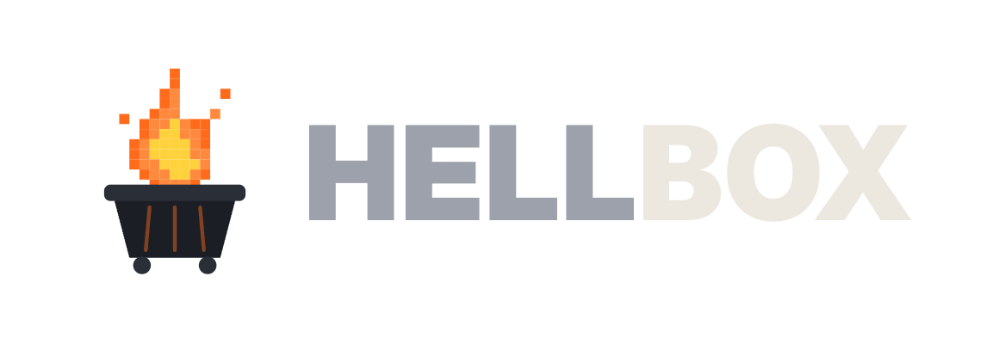
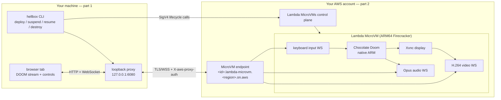

<div align="center">

<picture>
  <source media="(prefers-color-scheme: dark)" srcset="docs/assets/hellbox-wordmark-dark.png">
  <source media="(prefers-color-scheme: light)" srcset="docs/assets/hellbox-wordmark-light.png">
  
</picture>

[](https://github.com/somoore/hellbox/actions/workflows/ci.yml)
[](https://github.com/somoore/hellbox/releases/latest)
[](LICENSE)

### DOOM inside an AWS Lambda MicroVM.

Suspend it mid firefight and the compute bill stops. Resume it and you are back on the exact
frame, same demon mid lunge, same health, same ammo.

</div>

---

Hellbox is a playable systems demo: native ARM64 Chocolate Doom running inside an
[AWS Lambda MicroVM](https://aws.amazon.com/blogs/aws/run-isolated-sandboxes-with-full-lifecycle-control-aws-lambda-introduces-microvms/)
in **your own AWS account**, streamed to your browser, with the whole machine — live memory
included — freezable and thawable at will. It is not a product; it exists to make Firecracker
MicroVMs feel real instead of abstract.

## Quickstart

You need AWS credentials configured (the AWS CLI, SSO, or environment variables). Then:

```bash
brew install somoore/hellbox/hellbox    # macOS/Linux — or: winget install somoore.hellbox
hellbox deploy
```

That is the whole install. `hellbox deploy` creates the AWS prerequisites, builds the DOOM
MicroVM image (~6 minutes — it compiles the engine and fetches the shareware WAD in the
cloud), launches it, **verifies the video/audio/input stream end to end**, and opens the tab.
No repo clone needed: the CloudFormation template and the image build context are embedded
in the binary.

In the tab: click the speaker icon for sound, click the game, and play — `W A S D` to move,
`Ctrl` to fire, `Space` to open doors. The **Suspend** button freezes the MicroVM and stops
compute billing; **Resume** restores the exact frame.

```bash
hellbox suspend               # freeze (compute billing stops)
hellbox resume                # thaw on the exact frame
hellbox deploy -r us-west-2   # deploy to any region with Lambda MicroVMs
hellbox deploy -p KEY=VALUE   # override CloudFormation stack parameters
hellbox deploy edit           # customize the stack template in $EDITOR
hellbox destroy --yes         # remove everything: microvm, image, bucket, stack, state
hellbox ps                    # list capsules and their state
```

Prefer the repo? `git clone https://github.com/somoore/hellbox && cd hellbox && ./deploy.sh`
does the same thing (and uses a `hellbox` already on your PATH).

> **Cost:** a suspended MicroVM is roughly cents per month; a running, streamed session is
> roughly $0.19/hour before data transfer. The MicroVM auto-suspends after ~5 idle minutes
> and wakes on traffic. When you're done for good: `hellbox destroy --yes`.

> **Updating:** `brew upgrade hellbox` / `winget upgrade somoore.hellbox`. To rebuild the
> MicroVM image on a new version: `hellbox rm`, then `hellbox deploy`.

> **Browser:** the low-latency H.264/Opus path uses WebCodecs — use current Chrome or Edge.
> `hellbox config set display vnc` switches to the noVNC fallback for other browsers.

## The two parts of Hellbox

### 1 · The `hellbox` CLI — runs on your machine

One Rust binary with two jobs:

- **Lifecycle driver.** Builds the MicroVM image, launches, suspends, resumes, and destroys
  it — SigV4 calls to the AWS control plane with your credentials.
- **The stream proxy.** The MicroVM's HTTPS endpoint demands an auth token in the
  `X-aws-proxy-auth` header, and browsers cannot set headers on navigations or WebSockets.
  So `hellbox open` mints a short-lived, port-scoped token and runs a loopback proxy on
  `127.0.0.1:6080` that injects it into every request. The token never reaches the browser.
  **This is why a local binary exists at all** — without the proxy, no browser could reach
  your MicroVM.

Get it however you like — every channel traces back to the same attestation-verified
GitHub release builds:

| Channel | Install | Update | Remove |
|---|---|---|---|
| Homebrew | `brew install somoore/hellbox/hellbox` | `brew upgrade hellbox` | `brew uninstall hellbox` |
| winget | `winget install somoore.hellbox` | `winget upgrade somoore.hellbox` | `winget uninstall somoore.hellbox` |
| GitHub Releases | [download](https://github.com/somoore/hellbox/releases) (or let `deploy.sh` fetch + verify) | rerun `deploy.sh` | delete the binary |
| Source | `cd rs-cli && make release` | `git pull` + rebuild | — |

### 2 · The AWS deployment — runs in your account

- A small **prerequisites stack** (CloudFormation): one private S3 bucket for build
  contexts and two least-privilege IAM roles. That's all the standing infrastructure.
- The **DOOM capsule**: a MicroVM image (built in the cloud from a Dockerfile that compiles
  SDL2 + Chocolate Doom and bakes in the shareware WAD) and the running MicroVM itself.

The CLI installs all of this for you — `hellbox deploy` — so you normally never touch
CloudFormation directly. If you only want the prerequisites stack, click
[](https://console.aws.amazon.com/cloudformation/home?region=us-east-1#/stacks/create/review?templateURL=https://hellbox-launch-932930471665.s3.amazonaws.com/doom.yaml&stackName=Hellbox)
or run `aws cloudformation deploy --stack-name Hellbox --template-file deploy/doom.yaml
--capabilities CAPABILITY_IAM` from a clone.

## How it works



Inside the MicroVM, DOOM renders into a headless X server; an encoder streams H.264 video
and Opus audio over WebSockets, the browser decodes them with WebCodecs, and keyboard input
flows back over a third WebSocket. Suspend/resume is a live memory snapshot — the control
panel in the page keeps working even while the machine is frozen.

Full design: [docs/architecture.md](docs/architecture.md) · threat model:
[docs/security.md](docs/security.md) · verified API facts:
[docs/microvm-ground-truth.md](docs/microvm-ground-truth.md)

<details>
<summary><b>Configuration</b> (environment variables)</summary>

| Variable | Default | What it does |
|---|---|---|
| `AWS_REGION` | `us-east-1` | Region to deploy into (any region with Lambda MicroVMs works; `hellbox deploy -r` overrides). |
| `HELLBOX_NAME` | `doom` | Capsule name for `deploy.sh` (the CLI uses `--name`). |
| `HELLBOX_STACK` | `Hellbox` | CloudFormation stack name. |
| `HELLBOX_REPO` | `somoore/hellbox` | Release repo `deploy.sh` downloads `hellbox` from. |
| `HELLBOX_VERSION` | latest release | Pin the `hellbox` binary to a specific release tag. |
| `HELLBOX_SKIP_ATTESTATION` | `0` | Set to `1` only if you deliberately want to skip `gh attestation verify`. |
| `HELLBOX_HOME` | `~/.hellbox` | Where config, state, and the cached binary live. |
| `HELLBOX_BIN` | none | Use a specific local `hellbox` binary. |

</details>

<details>
<summary><b>Drive each piece by hand</b> (without <code>hellbox deploy</code> or <code>deploy.sh</code>)</summary>

**1. Create the prerequisites stack** — Launch Stack button above, or
`aws cloudformation deploy --region us-east-1 --stack-name Hellbox --template-file
deploy/doom.yaml --capabilities CAPABILITY_IAM`.

**2. Write `~/.hellbox/config.toml`** from the stack Outputs (all five keys required;
`display` optional — `h264` is the low-latency WebCodecs path):

```toml
region             = "us-east-1"
artifact_bucket    = "<ArtifactBucket output>"
build_role_arn     = "<BuildRoleArn output>"
execution_role_arn = "<ExecutionRoleArn output>"
base_image_arn     = "arn:aws:lambda:us-east-1:aws:microvm-image:al2023-1"
display            = "h264"
```

**3. Drive the lifecycle:**

```bash
hellbox build      # zip capsule -> S3 -> build image (compiles engine, fetches WAD)
hellbox up         # launch a MicroVM from the image
hellbox open       # mint a token, start the proxy, open the tab
hellbox suspend    # freeze (billing stops)
hellbox resume     # thaw on the exact frame
hellbox down       # terminate the MicroVM (keeps the image)
hellbox rm         # terminate and delete the image
hellbox ps         # list capsules
```

`hellbox build` uses `./capsule` when run from a clone, or the capsule embedded in the
binary otherwise; `--capsule-dir` points it anywhere else (e.g. to stage your own WAD —
see [capsule/app/](capsule/app/)).

</details>

## Legal

Hellbox is an independent technical demonstration. It is not affiliated with, endorsed by,
sponsored by, or approved by AWS, Amazon.com, id Software, Bethesda, ZeniMax, Microsoft, or
their affiliates. "AWS", "AWS Lambda", and "DOOM" are trademarks of their respective owners.

Hellbox runs the GPLv2 Chocolate Doom engine with the freely-redistributable shareware
`DOOM1.WAD`. It does not include or distribute retail DOOM game assets; the build process
downloads the shareware WAD and compiles Chocolate Doom at image build time. You are
responsible for any AWS charges incurred in your own account.

See [LEGAL.md](LEGAL.md) for full third-party notices, trademark disclaimers, asset usage
notes, and license information.
