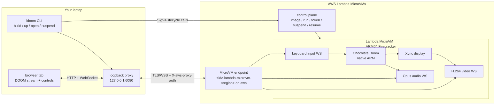

<div align="center">

# LambdaDoom

[](https://rust-reportcard.xuri.me/report/github.com/somoore/lambdadoom)

### DOOM inside an AWS Lambda MicroVM.

Suspend it mid firefight and the compute bill stops. Resume it and you are back on the exact
frame, same demon mid lunge, same health, same ammo.

</div>

---

```bash
# after setup
ldoom open   # a browser tab opens. it's DOOM. it's running in the cloud.
```

LambdaDoom is DOOM running inside an AWS Lambda MicroVM, streamed to your browser.

Click Suspend and the machine freezes mid-fight. Compute billing stops. Click Resume and you
are back on the same frame, with the same health, ammo, sound, and bad decisions.

This is not a product. It is a playable systems demo: a way to make AWS Lambda MicroVMs feel
real instead of abstract.

## Quickstart

You need the [AWS CLI](https://aws.amazon.com/cli/) configured with credentials. Then:

```bash
git clone https://github.com/somoore/LambdaDoom
cd LambdaDoom
./deploy.sh
```

`deploy.sh` deploys the AWS prerequisites, downloads the prebuilt `ldoom` CLI for your system,
verifies its SHA256 checksum and GitHub artifact attestation when possible, builds the MicroVM
image, launches it, and opens DOOM in your browser. In the tab: click the speaker icon for
sound, click the game, and play (`W A S D` to move, `Ctrl` to fire, `Space` to open doors).
Hit Suspend when you step away to stop the compute bill, and Resume to pick up where you left
off.

> **Cost:** a suspended MicroVM is roughly cents per month, and a running, streamed session is
> roughly $0.19 per hour before data transfer. The actual bill is:
> `(running vCPU/GB-seconds) + snapshot read/write + snapshot storage + internet data transfer`.
> Video/audio bitrate, region, and suspend/resume cycles matter. Suspend when you walk away,
> or run `./uninstall.sh` to remove everything (the MicroVM, the image, the stack, and all local
> state).

> **Browser:** the low-latency H.264/Opus path uses WebCodecs, so use current Chrome or Edge
> for the intended experience. Safari and Firefox support may lag; use `ldoom config set
> display vnc` for the noVNC fallback if the WebCodecs page cannot decode video or audio.

## Why this exists

AWS Lambda MicroVMs are clearly useful for AI agent sandboxing: isolated machines, lifecycle
control, and the ability to freeze and resume work.

I wanted to take a step back from the AI rush, put on some headphones, and fight demons.

DOOM is a ridiculous test case, but a useful one. It makes the invisible parts of serverless
visible: pixels, audio, keyboard input, browser access, lifecycle control, and live memory
state. A normal demo can prove an API works. DOOM lets you feel what the primitive does.

## What is happening?

AWS Lambda MicroVMs run your code inside Firecracker-backed microVMs with serverless lifecycle
control. You get hardware virtualization boundaries, near-instant launch, HTTPS/WSS ingress,
and the ability to freeze a running machine and resume it later with memory state intact. They
are powered by Firecracker, the same virtualization behind AWS Lambda. AWS launched them in June
2026:
[the announcement](https://aws.amazon.com/blogs/aws/run-isolated-sandboxes-with-full-lifecycle-control-aws-lambda-introduces-microvms/).

LambdaDoom uses that primitive as literally as possible: run a native ARM build of Chocolate
Doom, stream its pixels and audio to a browser, send keyboard input back in, then freeze and
resume the whole machine while the game is still alive.

## How it works



A small Rust CLI (`ldoom`) drives the lifecycle. Inside the MicroVM, native ARM Chocolate Doom
renders into a headless X server; an encoder streams it as H.264 with Opus audio over
WebSockets, and the browser decodes it with WebCodecs. The MicroVM endpoint needs an auth
header that browsers cannot set, so `ldoom open` runs a tiny loopback proxy that injects it.

Full design is in [docs/architecture.md](docs/architecture.md), the security model is in
[docs/security.md](docs/security.md), and the verified MicroVMs API facts are in
[docs/microvm-ground-truth.md](docs/microvm-ground-truth.md). To replace DOOM with another
capsule, see [docs/generalizing.md](docs/generalizing.md).

## Demo media

Demo screenshots and clips should come from a real LambdaDoom session, not a mock page. Once
you have a running proxy:

```bash
ldoom open --name doom --no-open
make capture-demo-media
```

That writes `assets/demo/lambdadoom-live.png` and `assets/demo/lambdadoom-live.webm` from the
live browser stream. The script exits instead of generating placeholder media if
`127.0.0.1:6080` is not serving LambdaDoom.

<details>
<summary><b>Configuration</b> (environment variables)</summary>

| Variable | Default | What it does |
|---|---|---|
| `AWS_REGION` | `us-east-1` | Region to deploy into (any region with Lambda MicroVMs works). |
| `LAMBDADOOM_NAME` | `doom` | Capsule name (the image and the MicroVM). |
| `LAMBDADOOM_STACK` | `LambdaDoom` | CloudFormation stack name. |
| `LAMBDADOOM_REPO` | `somoore/LambdaDoom` | Release repo to download `ldoom` from. |
| `LAMBDADOOM_VERSION` | latest release | Pin the `ldoom` binary to a specific release tag. |
| `LAMBDADOOM_SKIP_ATTESTATION` | `0` | Set to `1` only if you deliberately want to skip `gh attestation verify`. |
| `LAMBDADOOM_HOME` | `~/.lambdadoom` | Where config, state, and the binary live. |
| `LDOOM_BIN` | none | Use a local `ldoom` binary instead of downloading one. |

</details>

<details>
<summary><b>Run it yourself</b> (without <code>deploy.sh</code>)</summary>

`./deploy.sh` in the Quickstart above is the easy path: it creates the stack, downloads the
`ldoom` binary, builds the image, launches it, and opens the tab. Do the steps below only if
you would rather drive each piece by hand.

**1. Create the prerequisite stack** (an S3 build bucket and two IAM roles). Either click
Launch Stack:

[](https://console.aws.amazon.com/cloudformation/home?region=us-east-1#/stacks/create/review?templateURL=https://lambdadoom-launch-932930471665.s3.amazonaws.com/doom.yaml&stackName=LambdaDoom)

or run the CLI:

```bash
aws cloudformation deploy --region us-east-1 --stack-name LambdaDoom \
  --template-file deploy/doom.yaml --capabilities CAPABILITY_IAM
```

**2. Get the `ldoom` binary.** Download the one for your system from
[Releases](https://github.com/somoore/LambdaDoom/releases), or build from source:
`cd rs-cli && make release`.

**3. Write `~/.lambdadoom/config.toml`** from the stack outputs (region, artifact bucket, and
the build and execution role ARNs).

**4. Drive the lifecycle:**

```bash
ldoom build      # zip capsule -> S3 -> build image (compiles engine, fetches WAD) -> CREATED
ldoom up         # launch a MicroVM from the image          (PENDING -> RUNNING)
ldoom open       # mint a token, open the browser tab, play DOOM
ldoom suspend    # freeze the MicroVM (compute billing stops)
ldoom resume     # thaw on the exact frame
ldoom down       # terminate the MicroVM (keeps the image so up can relaunch)
ldoom rm         # full teardown: terminate and delete the image
ldoom ps         # list capsules and their state
```

</details>

## Legal

LambdaDoom is an independent, unofficial demo project. It is not affiliated with, sponsored by,
endorsed by, or approved by AWS, Amazon.com, id Software, Bethesda, ZeniMax, Microsoft, or their
affiliates.

LambdaDoom does not include or distribute retail DOOM game assets. By default, the build process
downloads the shareware `DOOM1.WAD` and builds Chocolate Doom at image build time. You are
responsible for any AWS charges incurred in your own account.

See [LEGAL.md](LEGAL.md) for full third-party notices, trademark disclaimers, asset usage notes,
and license information.
