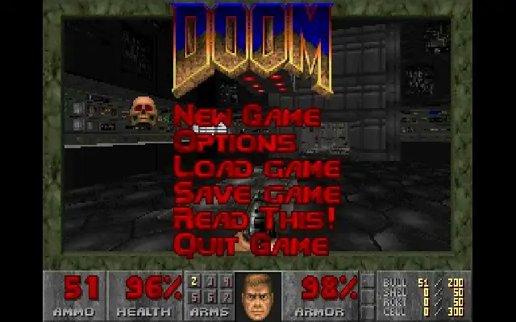
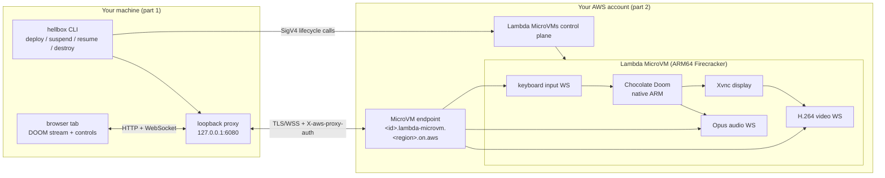

<div align="center">

<p>
  
  &nbsp;
  <picture>
    <source media="(prefers-color-scheme: dark)" srcset="docs/assets/hellbox-word-dark.svg">
    <source media="(prefers-color-scheme: light)" srcset="docs/assets/hellbox-word-light.svg">
    
  </picture>
</p>

[](https://github.com/somoore/hellbox/actions/workflows/ci.yml)
[](https://github.com/somoore/hellbox/releases/latest)
[](LICENSE)

### DOOM inside an AWS Lambda MicroVM.

Suspend it mid firefight and the compute bill stops.<br>
Resume it and you're back on the exact frame, same demon mid lunge, same health, same ammo.



</div>

---

Hellbox is a playable systems demo: native ARM64 Chocolate Doom running inside an
[AWS Lambda MicroVM](https://aws.amazon.com/blogs/aws/run-isolated-sandboxes-with-full-lifecycle-control-aws-lambda-introduces-microvms/)
in your own AWS account, streamed to your browser. You can freeze the whole machine, live
memory and all, then thaw it later. It is not a product. It exists to make Firecracker
MicroVMs feel real instead of abstract.

## Quickstart

You need AWS credentials configured (the AWS CLI, SSO, or environment variables). Then:

```bash
brew install somoore/hellbox/hellbox    # macOS/Linux (Windows: see "Windows install" below)
hellbox deploy
```

<details>
<summary><b>Windows install</b></summary>
<br>

The Homebrew line in the Quickstart is macOS/Linux. On Windows, grab the prebuilt exe —
no repo clone is required, because `hellbox deploy` carries the CloudFormation template
and the capsule build context inside the binary.

**From a clone (PowerShell):**

```powershell
./install.ps1      # downloads the exe, verifies SHA256 + build attestation, adds it to PATH
hellbox deploy
```

`install.ps1` is the Windows parallel to `deploy.sh`'s install step. It resolves your
architecture (x86_64 or arm64), verifies the release's GitHub build-provenance attestation —
the same trust anchor `deploy.sh` uses — caches the exe under `~/.hellbox/bin`, and puts it on
your PATH. It stops there; you run `hellbox deploy` yourself. It honors `HELLBOX_VERSION`,
`HELLBOX_HOME`, and `HELLBOX_SKIP_ATTESTATION` just like `deploy.sh`, and needs the
[GitHub CLI](https://cli.github.com) (`winget install GitHub.cli`) to check the attestation.

**Without a clone (manual):** download `hellbox-windows-x86_64.exe` (or `-arm64`) and its
`.sha256` from [Releases](https://github.com/somoore/hellbox/releases/latest), then in PowerShell:

```powershell
# 1. Confirm the download matches its checksum sidecar.
(Get-FileHash .\hellbox-windows-x86_64.exe -Algorithm SHA256).Hash -eq `
  (Get-Content .\hellbox-windows-x86_64.exe.sha256 -Raw).Trim().Split()[0].ToUpper()   # -> True

# 2. Verify build provenance (the real trust anchor; needs gh). --source-ref
#    binds the check to the tag you downloaded, so an older artifact from the
#    same workflow can't pass. Use the release tag you fetched (e.g. v1.0.18).
gh attestation verify .\hellbox-windows-x86_64.exe --repo somoore/hellbox `
  --signer-workflow github.com/somoore/hellbox/.github/workflows/release.yml `
  --source-ref refs/tags/<tag>

# 3. Rename to hellbox.exe, move it onto your PATH, then:
hellbox deploy
```

Either way you need AWS credentials configured (the AWS CLI, SSO, or environment variables)
before `hellbox deploy`; the binary reads the standard AWS credential chain. Use current
Chrome or Edge for the low-latency H.264 path — other browsers can fall back with
`hellbox config set display vnc`.

**To uninstall**, run `./uninstall.ps1` (the Windows parallel to `uninstall.sh`): it removes
`~/.hellbox` and drops it from your PATH, and then *asks* whether to also tear down your AWS
resources (the MicroVM, image, bucket, and stack). Removing the CLI never deletes anything in
AWS without your confirmation; answer no (the default) to keep your deployment, or set
`HELLBOX_YES=1` to confirm teardown non-interactively.

</details>

<details>
<summary><b>What that does, how to play, and how to come back later</b></summary>
<br>

That's the whole install. `hellbox deploy` creates the AWS prerequisites, builds the DOOM
MicroVM image in the cloud (about 4 to 5 minutes; the engine comes prebuilt from CI and
the shareware WAD is fetched there, nothing compiles on your machine), launches it,
verifies the video, audio, and input streams end to end, and opens the tab. No repo clone
needed. The CloudFormation template and the image build context ship inside the binary.

In the tab: click the speaker icon for sound, click the game, and play. `W A S D` to move,
`Ctrl` to fire, `Space` to open doors. The **Suspend** button freezes the MicroVM and stops
compute billing. **Resume** puts you back on the exact frame.

Coming back later, whether that's an hour or a week? One word:

```bash
hellbox    # same as `hellbox play`: reconnect, resume, or relaunch, then open the tab
```

Suspended machines only persist for about 8 hours before AWS terminates them, so after a
few days away your machine is usually gone. `hellbox` figures that out and relaunches from
your image. Takes about 15 seconds.

</details>

<details>
<summary><b>Everyday commands</b></summary>
<br>

```bash
hellbox suspend               # freeze (compute billing stops)
hellbox resume                # thaw on the exact frame
hellbox ps                    # list capsules and their state
hellbox deploy -r us-west-2   # deploy to any region with Lambda MicroVMs
hellbox deploy -p KEY=VALUE   # override CloudFormation stack parameters
hellbox deploy edit           # customize the stack template in $EDITOR
hellbox destroy               # remove everything, with a typed confirmation first
```

Full reference, flags, and troubleshooting: [docs/cli.md](docs/cli.md).

</details>

<details>
<summary><b>Cost, updating, browsers, and the repo option</b></summary>
<br>

**Cost** (us-east-1, ARM, [official rates](https://aws.amazon.com/lambda/pricing/), default
1 vCPU / 2 GB MicroVM). Running and streaming: about $0.13/hour of compute, billed per
second (it can burst above the baseline under load), plus data transfer. The stream runs
roughly 0.5 to 1 GB/hour, and AWS gives you 100 GB/month of free egress before $0.09/GB
kicks in. A suspend/resume cycle costs about a penny. A suspended machine only pays
snapshot storage ($0.08/GB-month, so around 16 cents/month prorated), and AWS terminates
it after about 8 hours anyway. The stored image also pays snapshot storage while you keep
it, likely a few tens of cents per month. The MicroVM auto-suspends after about 5 idle
minutes and wakes on traffic, so walking away is cheap. Done for good? `hellbox destroy`
ends all of it.

**Updating.** `brew upgrade hellbox`. To rebuild the MicroVM image on a new version, run
`hellbox rm`, then `hellbox deploy`.

**Browsers.** The low-latency H.264/Opus path uses WebCodecs, so use current Chrome or
Edge. `hellbox config set display vnc` switches to the noVNC fallback for other browsers.

**Prefer the repo?** `git clone https://github.com/somoore/hellbox && cd hellbox &&
./deploy.sh` does the same thing, and it picks up a `hellbox` already on your PATH.

</details>

## The two parts of Hellbox

<details>
<summary><b>1 · The <code>hellbox</code> CLI, which runs on your machine</b></summary>
<br>

One Rust binary with two jobs:

- **Lifecycle driver.** Builds the MicroVM image, launches, suspends, resumes, and destroys
  it. These are SigV4 calls to the AWS control plane with your credentials.
- **The stream proxy.** The MicroVM's HTTPS endpoint wants an auth token in the
  `X-aws-proxy-auth` header, and browsers cannot set headers on navigations or WebSockets.
  So `hellbox open` mints a short-lived, port-scoped token and runs a loopback proxy on
  `127.0.0.1:6080` that injects it into every request. The token never reaches the browser.
  This is why a local binary exists at all: without the proxy, no browser could reach your
  MicroVM.

Get it however you like. Every channel traces back to the same attestation-verified GitHub
release builds:

| Channel | Install | Update | Remove |
|---|---|---|---|
| Homebrew | `brew install somoore/hellbox/hellbox` | `brew upgrade hellbox` | `brew uninstall hellbox` |
| Windows (PowerShell) | `./install.ps1` (or download the exe from Releases) | rerun `install.ps1` | `./uninstall.ps1` |
| GitHub Releases | [download](https://github.com/somoore/hellbox/releases) (or let `deploy.sh` fetch and verify) | rerun `deploy.sh` | delete the binary |
| Source | `cd rs-cli && make release` | `git pull` and rebuild | |

</details>

<details>
<summary><b>2 · The AWS deployment, which runs in your account</b></summary>
<br>

- A small **prerequisites stack** (CloudFormation): one private S3 bucket for build
  contexts and two least-privilege IAM roles. That's all the standing infrastructure.
- The **DOOM capsule**: a MicroVM image, built in the cloud from a Dockerfile that installs
  a CI-prebuilt SDL2 + Chocolate Doom stack (hash-pinned, attestation-signed) and bakes in
  the shareware WAD, plus the running MicroVM itself.

**If you use the CLI, this part is automatic.** `hellbox deploy` creates the stack, builds
the image, and launches the MicroVM for you. There is nothing to click and no
CloudFormation to touch.

<details>
<summary>Manual option: create the stack yourself (skip this if you use <code>hellbox deploy</code>)</summary>
<br>

Some people want to create the prerequisites stack by hand first, for example to review
exactly what lands in their account before running anything. That is the only reason this
button exists:

[](https://console.aws.amazon.com/cloudformation/home?region=us-east-1#/stacks/create/review?templateURL=https://hellbox-launch-932930471665.s3.amazonaws.com/doom.yaml&stackName=Hellbox)

```bash
# or, from a clone:
aws cloudformation deploy --region us-east-1 --stack-name Hellbox \
  --template-file deploy/doom.yaml --capabilities CAPABILITY_IAM
```

Either way, `hellbox deploy` afterwards detects the existing stack and just uses it.

</details>

</details>

## How it works

<details>
<summary><b>The full picture: what talks to what, and how the pixels reach you</b></summary>
<br>



Inside the MicroVM, DOOM renders into a headless X server. An encoder streams H.264 video
and Opus audio over WebSockets, the browser decodes them with WebCodecs, and keyboard input
flows back over a third WebSocket. Suspend and resume work on a live memory snapshot, and
the control panel in the page keeps working even while the machine is frozen.

</details>

## Docs

<details>
<summary><b>Deep dives: CLI reference, architecture, security, API ground truth</b></summary>
<br>

- **[CLI reference](docs/cli.md)**: every command, configuration, and troubleshooting
- **[Architecture](docs/architecture.md)**: the full design and the platform constraints that shaped it
- **[Security](docs/security.md)**: trust boundaries, what protects you, deliberate non-goals
- **[MicroVM ground truth](docs/microvm-ground-truth.md)**: live-verified Lambda MicroVMs API facts

</details>

## Legal

<details>
<summary><b>Trademarks, game assets, and licensing</b></summary>
<br>

Hellbox is an independent technical demonstration. It is not affiliated with, endorsed by,
sponsored by, or approved by AWS, Amazon.com, id Software, Bethesda, ZeniMax, Microsoft, or
their affiliates. "AWS", "AWS Lambda", and "DOOM" are trademarks of their respective owners.

Hellbox runs the GPLv2 Chocolate Doom engine with the freely-redistributable shareware
`DOOM1.WAD`. It does not include or distribute retail DOOM game assets. The build process
downloads the shareware WAD and compiles Chocolate Doom at image build time. You are
responsible for any AWS charges incurred in your own account.

See [LEGAL.md](LEGAL.md) for full third-party notices, trademark disclaimers, asset usage
notes, and license information.

</details>
