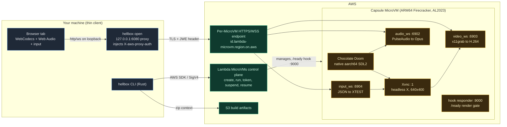
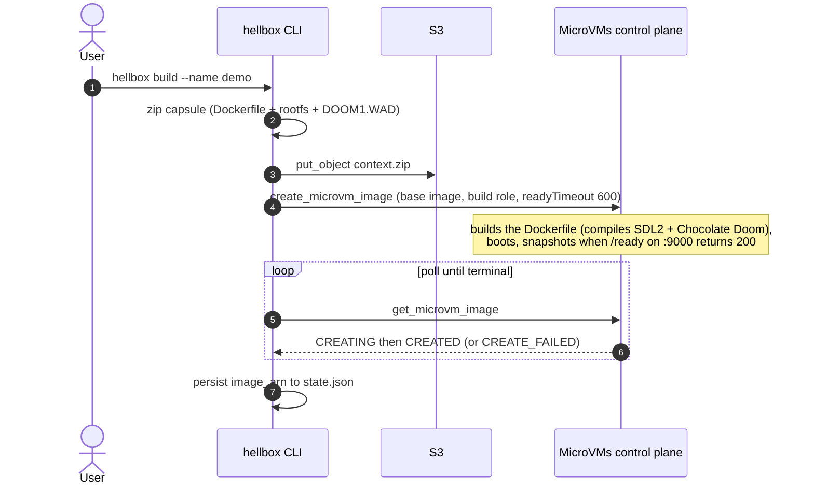
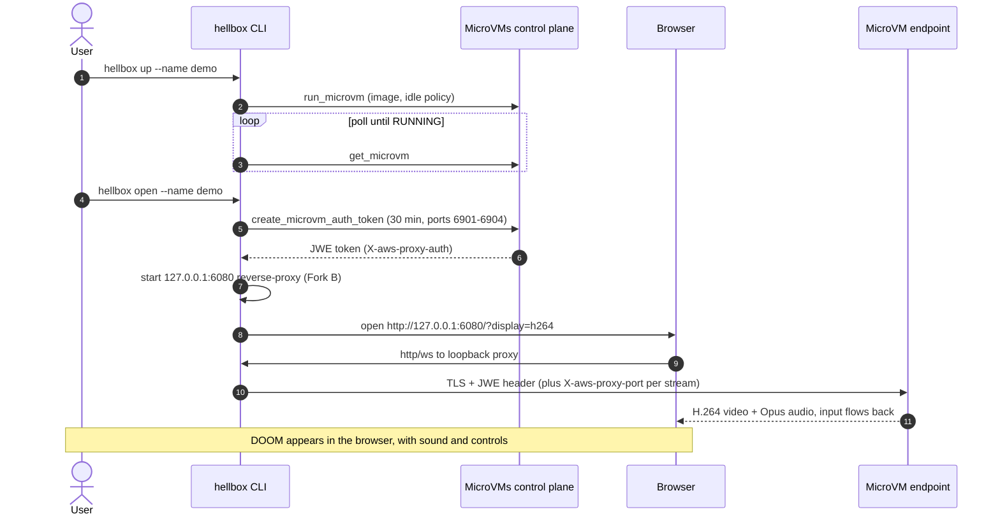
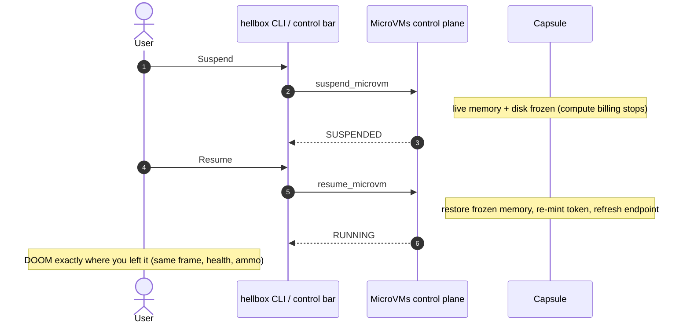
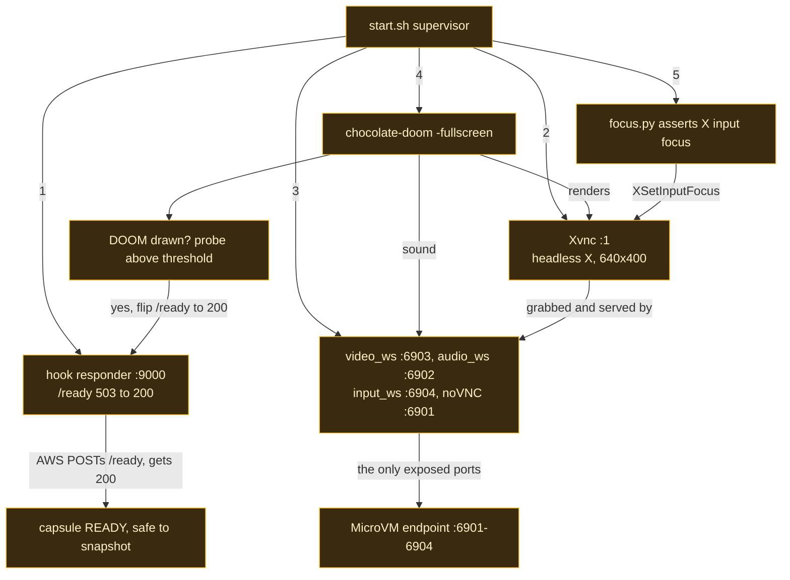

# Architecture

How I run native DOOM inside an AWS Lambda MicroVM and stream it to a browser tab. Most of
the design came from working around the platform's constraints, which I call out as I go.

> **Status: proven end to end in three regions** (us-east-1, us-east-2, us-west-2). The
> `hellbox` CLI drives the real control plane through the full lifecycle: one-command
> `deploy`/`destroy` plus `build`, `up`, `open`, `suspend`, `resume`, `down`, with the
> CloudFormation template and capsule build context embedded in the binary. Native
> Chocolate Doom streams with video, audio, and keyboard input, and suspends and resumes
> on a live memory snapshot. The API values below are ones I verified live; see
> [microvm-ground-truth.md](microvm-ground-truth.md). CLI usage lives in [cli.md](cli.md).

**How to read this:** sections 1-3 explain the flow, sections 4-7 cover the hard parts that
made the demo work, and sections 8-9 list the implementation choices and repo layout.

---

## 1. System overview

Three pieces: a thin client (your machine), the AWS control plane (the Lambda MicroVMs
lifecycle API), and the capsule (the running MicroVM). Your machine never runs DOOM. It
drives the lifecycle and renders the stream.



---

## 2. The platform constraints

Lambda MicroVMs are opinionated. Each constraint below shaped the design.

| Constraint | What it meant for the design |
|---|---|
| **ARM64 only** | DOOM is a native aarch64 build (Chocolate Doom), so it runs directly on the ARM CPU with no translation layer and renders reliably across the fleet. macOS is out of scope. |
| **No SDL2 in Amazon Linux 2023** (no EPEL) | The Dockerfile compiles the SDL stack from source: SDL2, SDL2_mixer, SDL2_net, then Chocolate Doom. |
| **HTTPS and WSS ingress only** (no raw TCP) | Everything is tunnelled over WebSockets: H.264 video, Opus audio, and a JSON input channel, plus a noVNC fallback. |
| **Auth is the `X-aws-proxy-auth` header** | The token has to be in the header; the same token in a query string returns 403. Browsers cannot set the header, so I run a loopback proxy (section 5). |
| **Lifecycle hooks are ENABLED/DISABLED toggles** | Hooks are switches, not script paths: `microvmImageHooks.ready`, `microvmHooks.run` and `resume`, plus `*TimeoutInSeconds` and `hooks.port`. I send `readyTimeoutInSeconds=600`. |
| **The ready hook has to be on port 9000** | AWS POSTs its readiness probe to `http://127.0.0.1:9000/aws/lambda-microvms/runtime/v1/ready`. Any other port fails the build with "Ready hook invocation timed out". |
| **Snapshot based** | DOOM has to be drawn at snapshot time (the ready render gate, section 4), or every run and resume restores a blank screen. Suspend and resume is a live memory snapshot. |
| **8 GB account memory quota** | Each MicroVM is at least 2 GB, and suspended MicroVMs still hold their memory, so plan for a few at a time, not dozens. |

---

## 3. Lifecycle

### 3.1 Build



> The snapshot is captured the moment `/ready` returns 200, so the capsule holds `/ready`
> at 503 until DOOM has drawn a non-black frame (a python-xlib center-crop brightness
> probe) **and** the audio/video/input services are listening on 6902-6904. A dead service
> at snapshot time would be dead on every future run and resume, so it fails the build
> loudly instead. The build runs two concurrent boots and both have to reach ready.

### 3.2 Run and open



### 3.3 Suspend and resume



Suspend and resume are control-plane calls, so the in-page control panel (injected by the
proxy, section 5) keeps working even while the MicroVM is frozen and the stream is dead.

---

## 4. Inside the capsule

`start.sh` brings the stack up in dependency order, runs the readiness responder on `:9000`,
and holds `/ready` at 503 until DOOM is drawn and the stream/input services are listening.
The display is Xvnc `:1` at 640x400 to match
Chocolate Doom's window, so the whole desktop is DOOM and the render probe reads a real frame
instead of a black border.



Four small servers replace an off-the-shelf remote desktop, since none fit all the
constraints at once (headless, no systemd, ARM64, a license I could ship):

- **`video_ws.py` on :6903** grabs the screen with ffmpeg `x11grab` and encodes it with
  libx264 (`ultrafast`, `zerolatency`, baseline). Each Annex-B access unit is one binary
  WebSocket frame, decoded in the browser by the WebCodecs `VideoDecoder` onto a `<canvas>`.
- **`audio_ws.py` on :6902** runs `parec` on the PulseAudio sink monitor, encodes Opus at
  96 kbps in 20 ms frames, and sends raw Opus packets, decoded by the WebCodecs `AudioDecoder`.
- **`input_ws.py` on :6904** turns JSON key and mouse events into XTEST `fake_input` calls
  through python-xlib. It retries its X connection while Xvnc finishes starting and runs
  under a restart loop. A dead input channel baked into the snapshot bricks input for the
  image's whole life, which is also why the ready gate requires it to be listening.
- **noVNC and websockify on :6901** is a single-socket fallback that carries display and
  input over one connection. The headless pixel checks use it.

`focus.py` is load-bearing. There is no window manager, so nothing assigns X keyboard focus
and XTEST keystrokes would land nowhere. It polls and calls `XSetInputFocus` on the game
window so input reaches DOOM.

---

## 5. The proxy

The MicroVM endpoint authenticates with a token (a JWE) in the `X-aws-proxy-auth` header and
selects the target port with `X-aws-proxy-port`. The same token in a query string returns
403, and browsers cannot set headers on a navigation or a `WebSocket`, so a tab cannot
authenticate to the endpoint on its own. So `hellbox open` runs a loopback reverse-proxy on
`127.0.0.1:6080`: the browser talks plain HTTP and WebSocket to loopback, and the proxy
injects the headers and forwards over TLS. The token lives only in the proxy.

The proxy (`rs-cli/src/proxy.rs`, on `hyper` 1.x) handles a request one of three ways:

1. **`/__hellbox/*` goes to the local control plane.** Never forwarded. Drives suspend,
   resume, and state with SigV4 (which works while the MicroVM is frozen) and powers the injected
   control panel.
2. **A WebSocket upgrade** dials the upstream `wss://` with the auth and port headers, answers
   the browser handshake locally, and pumps frames both ways until either side closes.
3. **Plain HTTP** is rebuilt against the upstream with the auth headers, and on the served
   page the proxy splices in the control panel.

A path-prefix table maps one loopback origin onto the four internal services via
`X-aws-proxy-port`: `/hellbox/audio` to 6902, `/hellbox/video` to 6903, `/hellbox/input` to 6904,
and everything else to the display port 6901.

Tokens expire after about 30 minutes, so the proxy treats an upstream 401/403 as "token
went stale": it mints a fresh one with your credentials, swaps it in, and retries the
request or WebSocket handshake once. Long play sessions never notice.

The `/__hellbox/*` endpoints run AWS calls with your credentials, so they are hardened
against CSRF, DNS rebinding, and blind local calls: the `Host` header must be loopback, the
`Origin` (when present) must be the loopback origin, the request must carry the per-session
HttpOnly `hellbox_control` cookie, and `suspend` and `resume` require `POST`. Full threat model
in [security.md](security.md).

---

## 6. The bandwidth budget

The endpoint caps traffic at a size-dependent rate, so the codecs are a design lever, not a
finishing touch. H.264 with motion-compensated P-frames (rather than VNC dirty rectangles)
cuts the video bytes a lot for full-motion content, and Opus at 96 kbps (rather than raw PCM)
cuts the audio bytes by about 13 to 15 times. Suspend-on-idle plus wake-on-traffic means an
unwatched tab is not burning a running MicroVM; the proxy tracks live WebSocket sessions to
drive that idle suspend.

---

## 7. The snapshot hazard

Two snapshot-specific concerns:

- **Render at snapshot.** The `/ready` 503 gate holds until DOOM is drawn, so neither a cold
  run nor a resume restores a blank screen. Enforced, not hoped for.
- **Entropy on resume.** A resumed MicroVM replays frozen entropy, so a CSPRNG seeded before the
  snapshot would produce the same bytes twice, a real problem for TLS terminated inside the
  MicroVM. In Hellbox the endpoint terminates TLS, so the hop inside the MicroVM is plain and
  this is not exercised. A future capsule that terminates TLS inside the MicroVM should reseed
  the entropy pool and bounce the listener on resume.

Full threat model in [security.md](security.md).

---

## 8. Why I chose each piece

| Concern | Choice | Why |
|---|---|---|
| DOOM on ARM64 | **Chocolate Doom** (native aarch64, SDL2) | Runs natively on ARM with no translation layer, and SDL2 gives real audio and input. Compiled from source because AL2023 ships no SDL2. |
| Display | **Xvnc (TigerVNC) at 640x400** | A headless X server sized to the engine window, so the whole desktop is DOOM and the render gate can detect it. |
| Video | **ffmpeg x11grab to libx264 to WebCodecs** | An inter-frame codec over WebSockets, far less egress than VNC dirty rectangles for full-motion content. |
| Audio | **PulseAudio to Opus to WebCodecs** | About 13 to 15 times less egress than raw PCM at transparent quality. |
| Input | **XTEST (python-xlib) over WebSockets** | A reverse channel for the H.264 path, with `focus.py` keeping the game window focused. |
| Stream auth | **Fork B loopback proxy** (`hellbox open`) | Browsers cannot set `X-aws-proxy-auth`, so a header-injecting loopback proxy is the only path that works. |
| CLI | **Rust** | One distributable binary using the official `aws-sdk-lambdamicrovms` crate (no `aws` CLI shell-out); adaptive SDK retry (backoff + client-side rate limiting). The CloudFormation template and capsule are embedded, so `hellbox deploy` needs no clone. Ships prebuilt (attestation-signed) via GitHub Releases and a Homebrew tap for Linux, macOS, and Windows on x86_64 and arm64. Source in `rs-cli/`. |
| Infra | **CloudFormation** (`deploy/doom.yaml`) | One self-serve stack: an S3 artifact bucket and the build and execution IAM roles. |

---

## 9. Repository layout

```
Hellbox/
├── deploy.sh               # one-command front door: deploy, fetch binary, build/up/open
├── uninstall.sh            # remove everything (MicroVM, image, stack, binary, local state)
├── deploy/doom.yaml        # CloudFormation: S3 bucket + IAM build/exec roles (Launch Stack)
├── capsule/                # the MicroVM image
│   ├── Dockerfile          #   compiles pinned SDL2 + Chocolate Doom, verifies WAD SHA256
│   ├── rootfs/opt/capsule/ #   start.sh, run_app.sh, focus.py, *_ws.py
│   └── app/                # optional WAD override drop zone (gitignored)
├── rs-cli/                 # the Rust `hellbox` CLI (shipped prebuilt; build only if you want)
│   ├── Cargo.toml  Makefile
│   └── src/                #   main, config, state, aws, poll, browser, proxy, embedded, commands/
└── docs/                   # architecture, security, ground truth, media, generalizing
```

Hellbox depends on the official `aws-sdk-lambdamicrovms` crate from crates.io. The capsule
pins and SHA256-verifies every external tarball/WAD it downloads during the image build.
