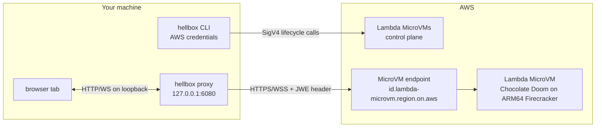

# Security

Hellbox is single user and deploys into your own account. You run the `hellbox` CLI, it
provisions resources in your AWS account, and only you connect to the stream. It is not a
multi-tenant service and is not hardened as one. This is the honest threat model.

## Trust boundaries

## What protects you

- **Encrypted transport.** Browser to proxy is loopback only and never leaves your machine.
  Proxy to the MicroVM endpoint is HTTPS and WSS, terminated by AWS.
- **Authenticated data plane.** The endpoint requires a JWE token in the `X-aws-proxy-auth`
  header, or it returns 403. Reaching your MicroVM requires a token minted with your AWS
  credentials, so a random person on the internet cannot.
- **Short-lived, scoped token.** `CreateMicrovmAuthToken` caps at 60 minutes and is restricted
  to ports 6901 to 6904. It is not a standing credential.
- **The browser never sees the token.** The proxy injects it server side, so it cannot leak
  into page JavaScript, history, or logs.
- **Loopback-only proxy.** It binds `127.0.0.1`, not your LAN or the internet.
- **Hardened control endpoints.** `/__hellbox/{state,suspend,resume}` drive the control
  plane with your credentials, so they require a loopback `Host`, a loopback `Origin` when
  present, an HttpOnly per-session `hellbox_control` cookie, and `POST` for `suspend` and
  `resume`. A cross-origin, DNS-rebound, or blind local request gets a 403. See
  `is_loopback_authority` and `cookie_has_control_secret` in `rs-cli/src/proxy.rs` and their
  tests.
- **Fetch-metadata navigation gate.** The data-plane paths accept top-level document
  navigations (any initiator, omnibox or a link click) but refuse embedding
  (`Sec-Fetch-Dest: iframe`/`object`, which would gain cookie-bearing same-origin
  WebSocket access) and scripted cross-site subresource loads. See
  `is_top_level_navigation` in `rs-cli/src/proxy.rs`.
- **Launch Stack template bucket.** The template bucket serves `doom.yaml` only to
  requests made *via CloudFormation* (`aws:CalledVia` condition, TLS required). Anonymous
  internet reads get 403, while the console's Launch Stack flow works from any account.
- **Wrong-account guard.** `hellbox deploy` records the account id it set things up in;
  `play` and `destroy` compare the current credentials against it and refuse to act on a
  mismatch, so a profile mixup can never aim a teardown at the wrong account. `destroy`
  additionally requires a typed confirmation and only deletes resources that prove they
  are Hellbox's (stack template markers, bucket cross-checked against the stack's own
  outputs).
- **Firecracker isolation in your own account.** No shared multi-tenant surface.
- **Least-privilege IAM.** The build role has only `s3:GetObject` on the artifact bucket plus
  CloudWatch Logs writes. The execution role has no permissions, since the MicroVM never calls
  back into AWS. The bucket is private, encrypted (AES256), and expires build contexts after
  three days.

## Residual risks and non-goals

The parts I deliberately left out of scope:

- **A local process running as you** can reach `127.0.0.1:6080` directly, since it is not
  bound by same-origin policy. The per-session `hellbox_control` cookie blocks blind calls to
  the control endpoints, but a same-user process that can scrape the browser session or proxy
  traffic is still out of scope: a process running as you already owns your shell and
  credentials. Those endpoints only suspend, resume, or read state for the one MicroVM you own,
  so the worst case is freezing or thawing your own game.
- **Your AWS credentials live on your machine** (via Granted, SSO, or environment variables),
  as with any AWS CLI or SDK use. They are never committed, and `.gitignore` excludes `.env`,
  `*.pem`, `*.key`, `aws-credentials*`, and `~/.hellbox/`. The binary reads credentials
  through the standard AWS chain and never writes them; `~/.hellbox/` holds only non-secret
  config and capsule state.
- **The prebuilt binary is a supply-chain dependency.** `deploy.sh` downloads `hellbox` from this
  repo's [GitHub Releases](https://github.com/somoore/hellbox/releases), verifies the
  release SHA256 sidecar, and verifies the GitHub artifact attestation when `gh` is available.
  Release builds are produced by the [release workflow](../.github/workflows/release.yml) from
  this source. The Homebrew tap pins SHA256s into its formula only after verifying the same
  attestations, and Homebrew enforces those hashes at install time. To avoid trusting a
  prebuilt artifact, build it yourself (`cd rs-cli && make release`) and point `deploy.sh`
  at it with `HELLBOX_BIN`. The binary runs locally with your credentials, so only run a
  release you trust.
- **Entropy after a snapshot.** A resumed MicroVM replays frozen entropy, so a CSPRNG seeded
  before the snapshot repeats its output. AWS terminates TLS, so the hop inside the MicroVM is
  plain and this is not exercised here. A capsule that terminates TLS inside the MicroVM must
  reseed on resume. See section 7 of [architecture.md](architecture.md).
- **Default egress is the public internet.** Omitting the network connectors gives the
  Lambda-managed defaults (JWE-authenticated ingress, internet egress). The MicroVM can reach
  the internet; it does not need to (the WAD and engine are baked at build time), but it is not
  network-isolated by default. **To lock egress down,** set `egress_connector_arn` in
  `~/.hellbox/config.toml` to a connector that denies all outbound; `hellbox up` wires any
  non-empty `egress_connector_arn` into `RunMicrovm` (see `up.rs`; leave it empty for the
  managed default). The runtime MicroVM needs no outbound, so a deny-all egress connector is
  safe.
- **Not multi-tenant, not production.** No auth between browser and proxy beyond loopback
  binding, no rate limiting, no audit logging. Do not expose the proxy port off your machine.

## Reporting

This is a personal demo. If you find a security issue, please open an issue or contact the repo
owner directly rather than posting a public exploit.

## Legal and scope

Hellbox does not include or distribute retail DOOM game assets. By default, the build process
downloads the shareware `DOOM1.WAD` and builds Chocolate Doom at image build time. See
[LEGAL.md](../LEGAL.md) for the full legal notice.
