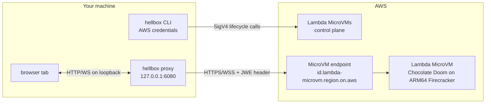

# Security

Hellbox is a single-user demo that runs in your own AWS account: you run the CLI, it
provisions resources with your credentials, and only you connect to the stream. It is not
multi-tenant and is not hardened as one. This is the honest threat model; the design it
protects lives in [architecture.md](architecture.md).

## Trust boundaries

## What protects you

- **Encrypted transport.** Browser to proxy is loopback only and never leaves your machine.
  Proxy to the MicroVM endpoint is HTTPS and WSS, terminated by AWS.
- **Authenticated data plane.** The endpoint requires a JWE token in the `X-aws-proxy-auth`
  header, or it returns 403. Reaching your MicroVM requires a token minted with your AWS
  credentials, so a random person on the internet cannot.
- **Short-lived, scoped token.** Hellbox mints a 30-minute token (the API caps at 60)
  restricted to ports 6901 to 6904. It is not a standing credential; the proxy re-mints
  transparently when one expires mid-session.
- **The browser never sees the token.** The proxy injects it server side, so it cannot leak
  into page JavaScript, history, or logs.
- **Loopback-only proxy.** It binds `127.0.0.1`, not your LAN or the internet.
- **Hardened control endpoints.** `/__hellbox/{state,suspend,resume}` drive the control
  plane with your credentials, so they require a loopback `Host`, a loopback `Origin` when
  present, an HttpOnly per-session `hellbox_control` cookie, and `POST` for `suspend` and
  `resume`. A cross-origin, DNS-rebound, or blind local request gets a 403. See
  `is_loopback_authority` and `cookie_has_control_secret` in `rs-cli/src/proxy.rs` and their
  tests.
- **Per-session entry token on the data plane.** The URL `hellbox` opens carries a
  one-time entry token (`?hbk=<per-session secret>`). The first navigation is only accepted
  if it presents that token; the served page then sets the HttpOnly `hellbox_control` cookie
  and every later request rides the cookie instead. A different local user can open
  `127.0.0.1:6080` but does not know the 128-bit secret, so their requests never establish a
  session. This is the portable stand-in for `SO_PEERCRED`, which only works on Unix-domain
  sockets, not the TCP loopback a browser needs. See `has_entry_token` and
  `allowed_initial_navigation` in `rs-cli/src/proxy.rs` and their tests.
- **Fetch-metadata navigation gate.** The data-plane paths accept top-level document
  navigations (omnibox or a link click) but refuse embedding (`Sec-Fetch-Dest:
  iframe`/`object`, which would gain cookie-bearing same-origin WebSocket access) and
  scripted cross-site subresource loads. A request carrying no fetch metadata at all now
  fails closed rather than being trusted on a site heuristic, since the entry token is what
  authorizes the first navigation. See `is_top_level_navigation` in `rs-cli/src/proxy.rs`.
- **Launch Stack template bucket.** The template bucket serves `doom.yaml` only to
  requests made *via CloudFormation* (`aws:CalledVia` condition, TLS required). Anonymous
  internet reads get 403, while the console's Launch Stack flow works from any account.
- **Wrong-account guard.** `hellbox deploy` records the account id it set things up in;
  `play` and `destroy` compare the current credentials against it and refuse to act on a
  mismatch, so a profile mixup can never aim a teardown at the wrong account. `destroy`
  additionally requires a typed confirmation and only deletes resources that prove they
  are Hellbox's (stack template markers, bucket cross-checked against the stack's own
  outputs).
- **Firecracker isolation in your own account.** No shared multi-tenant surface.
- **Least-privilege IAM.** The build role has only `s3:GetObject` on the artifact bucket plus
  CloudWatch Logs writes. The execution role has no permissions, since the MicroVM never calls
  back into AWS. The bucket is private, encrypted (AES256), and expires build contexts after
  three days.

## Residual risks and non-goals

The parts I deliberately left out of scope:

- **A process running as your own user** is out of scope, and honestly so. It can reach
  `127.0.0.1:6080`, and it can also lift the `hellbox_control` cookie straight out of the
  browser's memory or read the entry token off the proxy, so the cookie and token do not
  stop it. That is fine: a process running as you already owns your shell, your browser, and
  your AWS credentials, so the proxy is not the interesting target. And even if it drives the
  control endpoints, they only suspend, resume, or read state for the one MicroVM you own, so
  the worst case is freezing or thawing your own game. The point is not that it *can't reach*
  the control plane; it can. The point is that it *doesn't matter* once something is already
  running as you.
- **A different local user on a shared host** is the case worth calling out, because it is
  *not* already game over. Another user can open `127.0.0.1:6080` (loopback is not
  per-user), but they cannot read your browser's cookie or your process memory. Before the
  entry token, they could shape a navigation-looking request and drive the data plane input
  channel into your game. The per-session entry token closes that: the first navigation
  requires a 128-bit secret only your browser was handed, so a foreign user's tokenless
  request is refused before it ever obtains the session cookie. Hellbox still assumes a
  single-user machine; this just means a shared host is not an open door.
- **Your AWS credentials live on your machine** (via Granted, SSO, or environment variables),
  as with any AWS CLI or SDK use. They are never committed, and `.gitignore` excludes `.env`,
  `*.pem`, `*.key`, `aws-credentials*`, and `~/.hellbox/`. The binary reads credentials
  through the standard AWS chain and never writes them; `~/.hellbox/` holds only non-secret
  config and capsule state.
- **The prebuilt binary is a supply-chain dependency.** Every release binary is built by
  the [release workflow](../.github/workflows/release.yml) from this source and carries a
  GitHub build-provenance attestation bound to that workflow and tag. Each install path
  checks it: Homebrew pins SHA256s into its formula only after verifying the attestation
  (and enforces those hashes at install time), and `deploy.sh` verifies the SHA256 sidecar
  plus the attestation (when `gh` is present) before running the binary. To trust nothing
  prebuilt, build it yourself (`cd rs-cli && make release`). The binary runs locally with
  your credentials, so only run a release you trust.
- **Entropy after a snapshot.** A resumed MicroVM replays frozen entropy, so a CSPRNG seeded
  before the snapshot repeats its output. AWS terminates TLS, so the hop inside the MicroVM is
  plain and this is not exercised here. A capsule that terminates TLS inside the MicroVM must
  reseed on resume. See section 7 of [architecture.md](architecture.md).
- **Default egress is the public internet.** Omitting the network connectors gives the
  Lambda-managed defaults (JWE-authenticated ingress, internet egress). The MicroVM can reach
  the internet; it does not need to (the WAD and engine are baked at build time), but it is not
  network-isolated by default. **To lock egress down,** set `egress_connector_arn` in
  `~/.hellbox/config.toml` to a connector that denies all outbound; `hellbox up` wires any
  non-empty `egress_connector_arn` into `RunMicrovm` (see `up.rs`; leave it empty for the
  managed default). The runtime MicroVM needs no outbound, so a deny-all egress connector is
  safe.
- **Not multi-tenant, not production.** The browser-to-proxy auth is a per-session cookie
  plus entry token over loopback, which is enough to fend off other origins and a different
  local user, not a real authentication system. No rate limiting, no audit logging. Do not
  expose the proxy port off your machine.

## Reporting

Found a security issue? Please open a
[private security advisory](https://github.com/somoore/hellbox/security/advisories/new) or
contact the repo owner directly rather than posting a public exploit. See
[SECURITY.md](../SECURITY.md).

## Legal and scope

Hellbox does not include or distribute retail DOOM game assets. By default, the build process
downloads the shareware `DOOM1.WAD` and builds Chocolate Doom at image build time. See
[LEGAL.md](../LEGAL.md) for the full legal notice.
